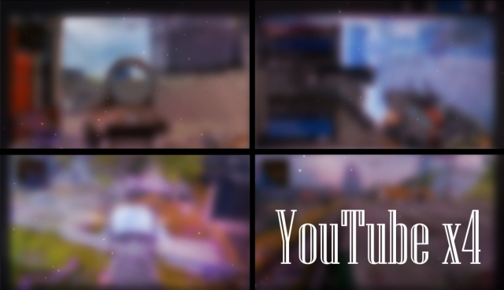
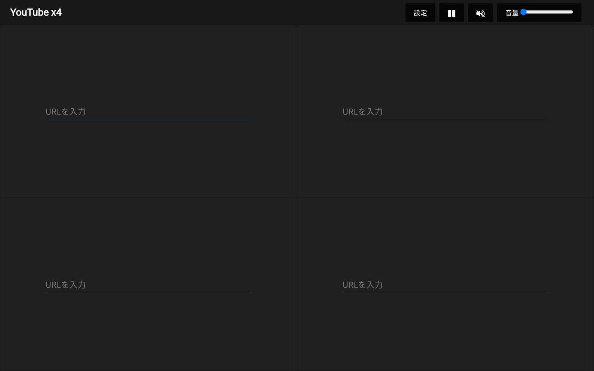

<div align="center">

# YouTube x4

YouTube の動画を 4 つ同時に再生する Web アプリ

[](https://developer.mozilla.org/docs/Web/HTML)
[](https://developer.mozilla.org/docs/Web/CSS)
[](https://developer.mozilla.org/docs/Web/JavaScript)
[](https://developers.google.com/youtube/iframe_api_reference)
[](LICENSE)
[](https://akkunlab.github.io/youtubex4/)



</div>

## 概要

YouTube x4 は、4 本の YouTube 動画を 1 画面に 2×2 で並べて同時に再生する Web アプリです。ゲーム実況の多視点比較や配信の同時視聴など、複数の動画を一度に眺めたいときに使います。静的な HTML / CSS / JavaScript だけで構成され、YouTube IFrame Player API を通じて 4 つのプレイヤーをまとめて制御します。

## 特徴

- **4 画面同時再生** — 画面を 2×2 に分割し、4 本の動画を並べて再生。ウィンドウサイズの変更に合わせてプレイヤーを自動リサイズ
- **URL を貼るだけ** — `youtube.com/watch?v=...` や `youtu.be/...` などの URL から動画 ID を抽出。不正な URL はアラートで通知
- **4 本そろったら自動開始** — すべての入力欄に URL を登録すると、ミュート状態で 4 つのプレイヤーが一斉に再生開始
- **一括コントロール** — 右上の設定バーのボタンから再生 / 一時停止、ミュート切替、音量スライダーを 4 つのプレイヤーにまとめて適用
- **ビルド不要** — npm やビルドツールを使わず、静的ファイルを配信するだけで動作（実行時に YouTube IFrame Player API と Google Fonts を外部から読み込む）

## デモ

ライブデモ: [https://akkunlab.github.io/youtubex4/](https://akkunlab.github.io/youtubex4/)

1. 4 つの入力欄それぞれに YouTube の URL を貼り付けて Enter を押す
2. 4 本すべて登録すると、プレイヤーが生成されて再生が始まる
3. 右上のボタンで再生 / 一時停止・ミュート・音量をまとめて操作する



画面幅 1280px 以下では音量スライダーが非表示になり、ボタン操作のみになります。

## 技術スタック

| 領域 | 技術 |
| --- | --- |
| マークアップ / スタイル | HTML5、CSS3（Flexbox、CSS 変数、`@media` によるレスポンシブ） |
| ロジック | Vanilla JavaScript（フレームワーク・ライブラリ不使用） |
| 動画再生 | [YouTube IFrame Player API](https://developers.google.com/youtube/iframe_api_reference) |
| アイコン | SVG シンボル（`assets/img/graphics.svg`） |
| フォント | Google Fonts（Roboto、Noto Sans JP） |
| ホスティング | GitHub Pages |

## セットアップ

前提: モダンブラウザとインターネット接続（YouTube IFrame Player API と Google Fonts を外部から読み込みます）。ビルド手順や環境変数はありません。

```bash
git clone https://github.com/Akkunlab/youtubex4.git
cd youtubex4
python3 -m http.server 8000
```

ブラウザで `http://localhost:8000/` を開きます。静的ファイルのみなので、`http.server` 以外の任意の静的サーバーでも配信できます。

## 構成

```text
.
├── index.html             # ヘッダー・設定バー・2×2 のプレイヤー枠
├── assets/
│   ├── css/style.css      # ダークテーマのレイアウトとレスポンシブ設定
│   ├── js/main.js         # URL 解析・プレイヤー生成・一括操作
│   └── img/graphics.svg   # 再生 / 一時停止・音量アイコン
├── docs/screenshot.png    # 起動時の画面
└── youtubex4.jpg          # キービジュアル
```

## ライセンス

[MIT](LICENSE)
